# Project Management Framework for Heavy Equipment Manufacturing
## Business & Product Requirements (Markdown)

**Version:** BRD/PRD v1.0  
**Audience:** Business leadership, PMO, Plant heads, Finance, Quality, Engineering  
**Purpose:** Define the business and functional requirements for a pragmatic, visual project management framework tailored to heavy equipment manufacturing. This document avoids technical design, delivery timelines, and effort estimates.

---

## 1) Business Requirements

### 1.1 Objectives
- Establish a single, standardized way to initiate, govern, and close projects across plants and functions.
- Improve predictability of delivery dates and cost outcomes for NPI, CapEx, Major Customer Orders, and Process Improvement projects.
- Enforce lightweight but clear quality gates and approvals without bureaucratic overhead.
- Provide portfolio-level visibility for leadership to prioritize, unblock, and allocate.

### 1.2 In-Scope (Business)
- Four project types with tailored templates: **NPI**, **CapEx**, **Major Customer Order**, **Process Improvement**.
- Project charter, lifecycle stages, approvals, risk register, budget vs. actual at phase level.
- Role clarity (RACI), executive dashboards (schedule, budget, quality bottlenecks), portfolio view.

### 1.3 Out of Scope (Business)
- Technology stack, delivery timelines, resource estimates, staffing plans.
- Detailed accounting or ERP configuration specifics.

### 1.4 Success Measures (Business-Level)
- Higher on-time milestone completion rate.
- Reduced budget variance on strategic projects.
- Faster decision-making at gates.
- Increased portfolio transparency and earlier risk detection.

### 1.5 Stakeholders & Responsibilities (Business)
- **Project Lead:** drives execution, maintains status, raises gates for approval.
- **Sponsor/Production Head (as applicable):** accountable for outcomes and key approvals.
- **Finance:** reviews budgets and variances.
- **Engineering:** validates specs/feasibility.
- **Quality:** signs off QA/testing stages.
- **PMO/Leadership:** portfolio oversight and prioritization.

### 1.6 Framework Overview (Visual)
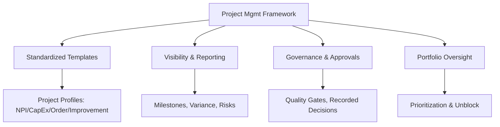

### 1.7 Manufacturing Lifecycle (Business Flow)
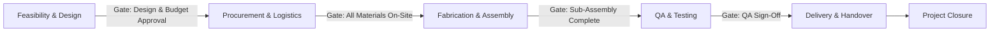

### 1.8 Governance & Approvals (Business Flow)
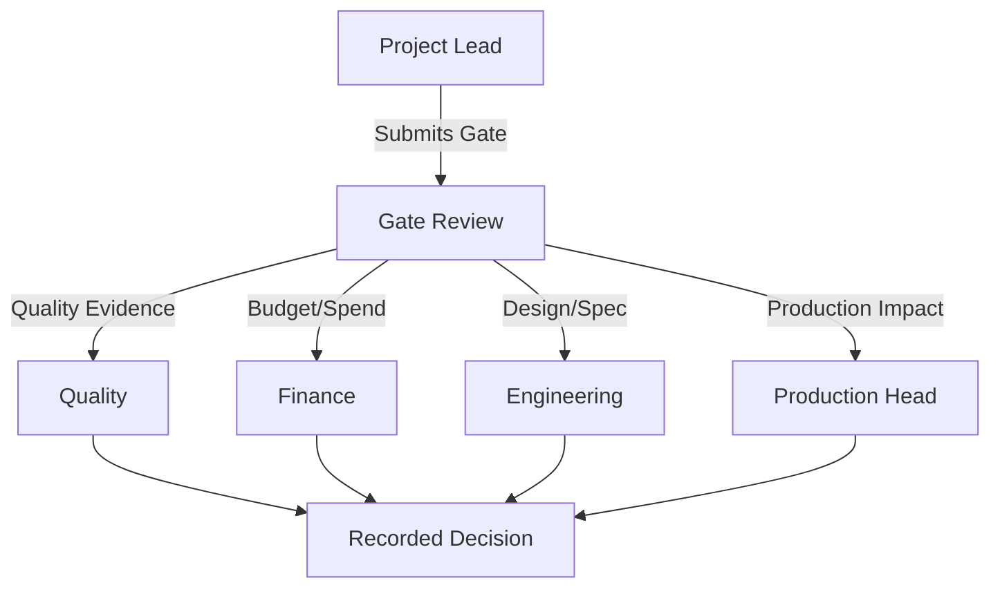

### 1.9 Risk & Escalation (Business Loop)
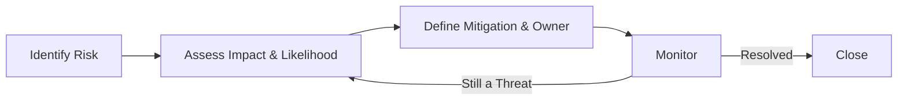

---

## 2) Product Requirements (Functional)

> Functional capabilities grouped as EPICs with features and business‑oriented acceptance criteria. No technical design included.

### EPIC A — Project Profiles & Templates
**Goal:** Make project initiation fast and consistent.

**Features**
1. Create four templates: NPI, CapEx, Major Customer Order, Process Improvement.
2. Each template includes a **Project Charter** with mandatory fields: Goal, Deliverable, Sponsor, Lead, Budget, Target Date.
3. Each template preloads a standard **Lifecycle** and **Gate names** relevant to that project type.

**Acceptance Criteria**
- Given a user selects a project type, when they create a new project, then the appropriate charter fields and lifecycle appear pre‑configured.
- Given a charter is saved, when mandatory fields are missing, then the project cannot proceed to the first gate.

### EPIC B — Lifecycle & Quality Gates
**Goal:** Ensure structured progress with minimal friction.

**Features**
1. Five default stages with configurable gate names and approvers per project type.
2. Gate decisions are recorded with approver name and decision (Approved/Rejected/Returned for changes).
3. Movement to the next stage is blocked until the gate decision is recorded.

**Acceptance Criteria**
- Given a project at a gate, when the required approvers record decisions, then the project can move to the next stage.
- Given a project is missing gate evidence, when a Lead attempts to progress, then a message explains what is missing.

**Diagram**
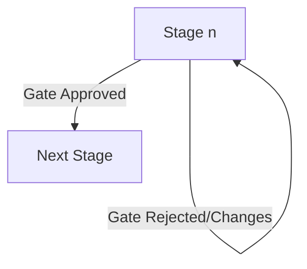

### EPIC C — Approvals & Governance
**Goal:** Make approvals clear, auditable, and timely without over‑engineering.

**Features**
1. Gate review collates inputs from Engineering, Finance, Production, and Quality as applicable.
2. Recorded decisions are immutable and tied to the specific gate.
3. Business rules define which approvers are required for which gates per project type.

**Acceptance Criteria**
- Given a gate is raised, when all required approvers have recorded decisions, then the system marks the gate as closed.
- Given a decision is recorded, when later viewed, then the record shows the decision, approver, date, and any notes.

**Diagram**
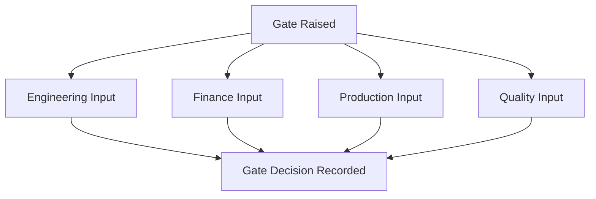

### EPIC D — Financial Oversight (Functional)
**Goal:** Provide basic cost visibility at the phase level for business control (not a replacement for accounting).

**Features**
1. Capture planned and actual costs per phase.
2. Calculate variance and require a reason when variance is present.
3. Highlight phases/projects with the largest variances.

**Acceptance Criteria**
- Given planned and actual values are entered, when a variance exists, then the variance and reason are visible on project and portfolio views.
- Given portfolio view is opened, when projects have high variance, then they are clearly highlighted for discussion.

**Diagram**
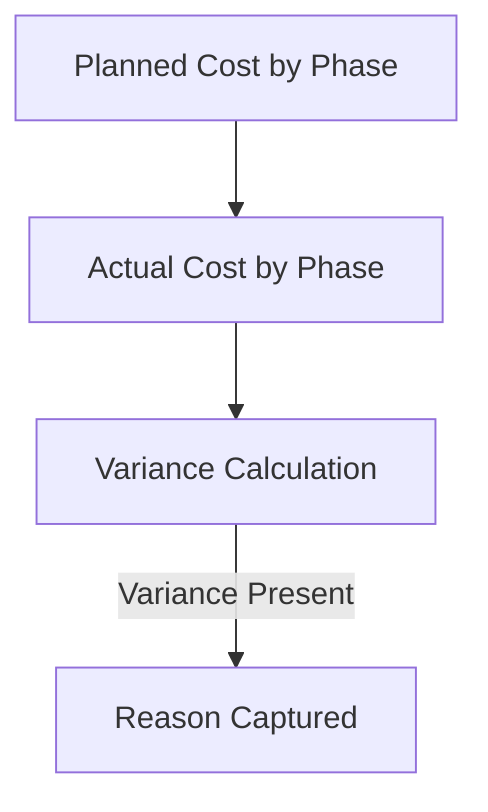

### EPIC E — Risk Management
**Goal:** Standardize risk capture and follow‑through.

**Features**
1. Risk register with category, impact, likelihood, owner, status, and mitigation.
2. Risks link to the phase they affect.
3. Visibility of top risks at portfolio level.

**Acceptance Criteria**
- Given a risk is created, when viewed, then it shows category, impact, likelihood, owner, and mitigation.
- Given portfolio view is opened, when risks exceed a threshold, then the top risks are summarized.

**Diagram**
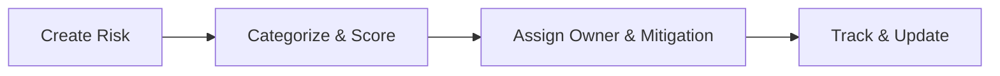

### EPIC F — Reporting & Dashboards
**Goal:** Provide simple, decision‑ready views without technical detail.

**Features**
1. Project dashboard with schedule adherence, budget variance, and QA bottlenecks.
2. Portfolio dashboard showing cross‑project health and top issues.

**Acceptance Criteria**
- Given a project dashboard is opened, when milestones and costs are updated, then KPIs reflect the current status.
- Given a portfolio dashboard is opened, when multiple projects are active, then leadership can see health, risks, and variances at a glance.

**Diagram (Illustrative)**
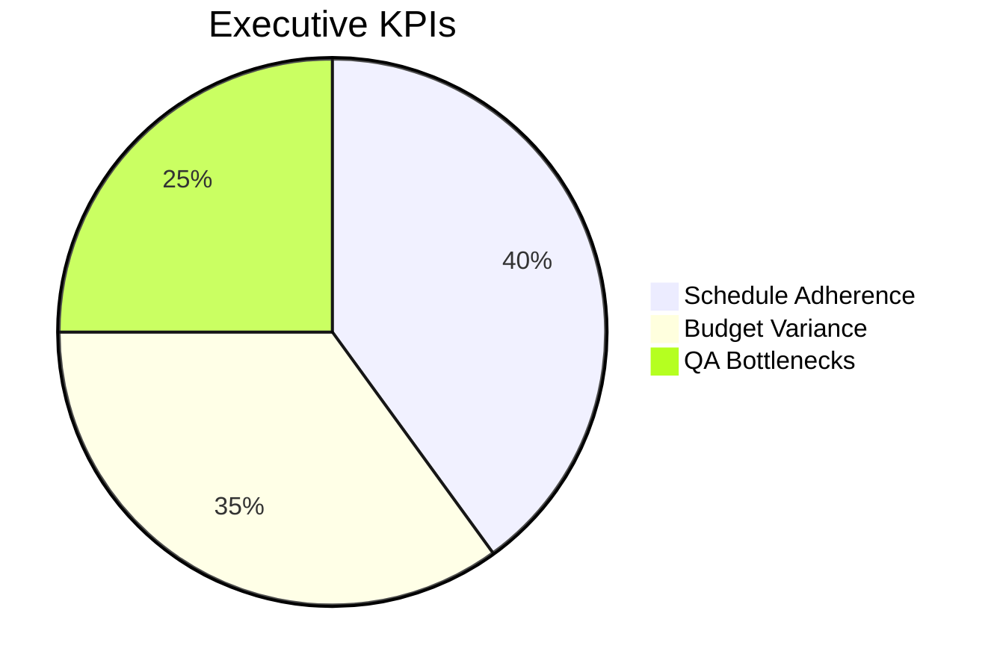

### EPIC G — Portfolio Management (Functional)
**Goal:** Enable leadership to prioritize and unblock across the project set.

**Features**
1. Portfolio view aggregating status, gates, risks, and variances.
2. Ability to flag cross‑project dependencies and blockers.
3. Meeting‑ready portfolio pack summary.

**Acceptance Criteria**
- Given a portfolio view is opened, when multiple projects have open gates or high variance, then they are flagged for leadership action.
- Given a dependency is recorded, when related projects are viewed, then the dependency and its status are visible.

### EPIC H — Templates, Lessons Learned & Reuse
**Goal:** Improve with each project by capturing knowledge.

**Features**
1. Save any project as a reusable template.
2. Capture lessons learned at closure and link them to templates.
3. Display relevant lessons during initiation of similar projects.

**Acceptance Criteria**
- Given a project is closed, when lessons are recorded, then they are associated with that project type.
- Given a new project is initiated, when a template is selected, then related lessons are visible.

---

## 3) Illustrative Examples (Business)

### 3.1 NPI Example — 10‑Ton Electric Excavator
- **Charter (sample):** Goal, field‑tested prototype as deliverable, Sponsor (CTO), Lead (NPI Manager), Budget, Target date.
- **Lifecycle:** Feasibility & Design → Procurement & Logistics → Fabrication & Assembly → QA & Testing → Delivery & Handover → Closure.
- **Key Gates:** Design & Budget Approval; All Materials On‑Site; Sub‑Assembly Complete; QA Sign‑Off; Project Closed.
- **Risks (examples):** Battery module lead time; compliance testing slots; operator training materials.

**Visual (NPI flow)**
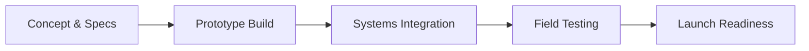

### 3.2 CapEx Example — New CNC Machine
- **Charter (sample):** ROI objective, Sponsor (Production Head), Lead (CapEx PM), Budget, Target date.
- **Gate Example:** “Ready for Purchase” requires Production and Finance recorded decisions.
- **Risk Examples:** Site readiness, power upgrades, operator certification.

**Visual (Gate path)**
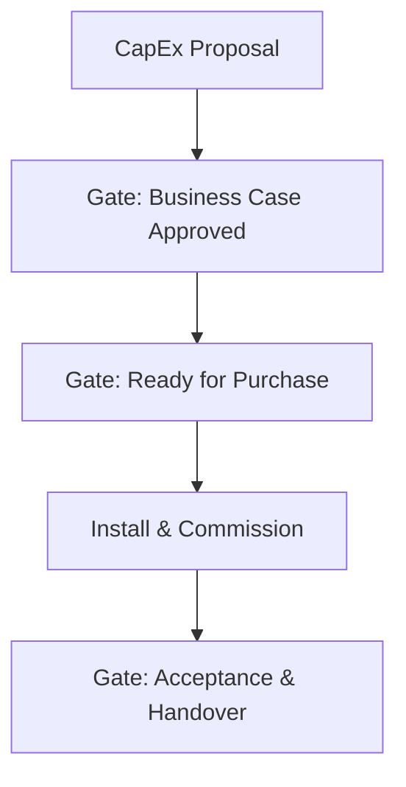

### 3.3 Major Customer Order — Custom Build
- **Charter (sample):** Customer spec reference, Lead (Order PM), Contract value, Delivery commitment.
- **Gate Example:** Engineering spec freeze before procurement; QA sign‑off before shipment.

**Visual (Spec → Build → Deliver)**
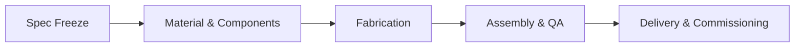

---

## 4) Policies & Governance (Functional)
- Every gate decision is recorded with approver identity and date.
- Variance requires a recorded reason at phase or project level.
- A single source of project truth is maintained; parallel unofficial trackers are retired.
- Portfolio review uses a standard pack: health summary, top risks, open gates, high variances, decisions/actions.

---

## 5) Glossary (Business)
- **Charter:** The concise definition of goal, deliverables, sponsor, lead, budget, and target date.
- **Gate:** A decision point required to move from one stage to the next.
- **Variance:** Difference between planned and actual at phase or project level.
- **Portfolio:** The set of active projects reviewed together for prioritization and unblocking.
- **Template:** A reusable pattern containing charter fields, lifecycle, gate names, and starter tasks.

---

### Final Note
This document is intentionally focused on business and functional needs with visual flows. No technical design, timelines, or effort estimates are included.

