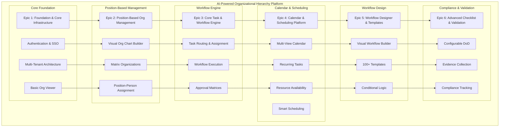
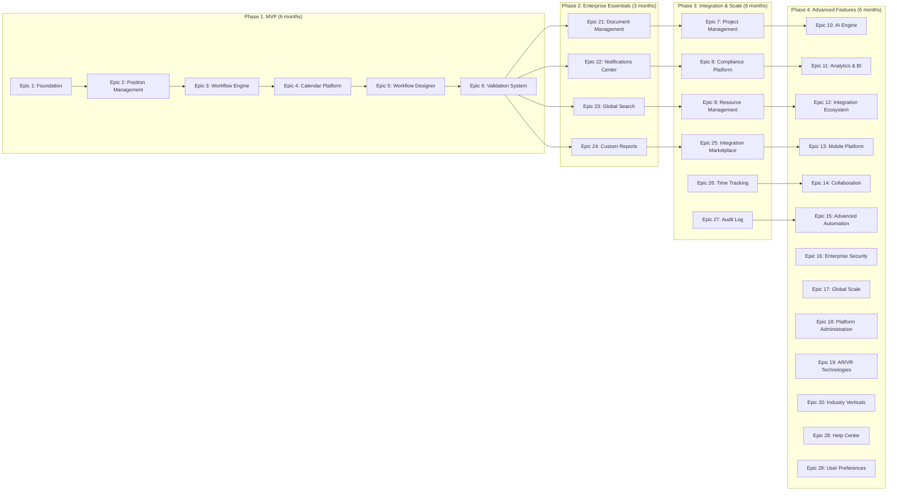
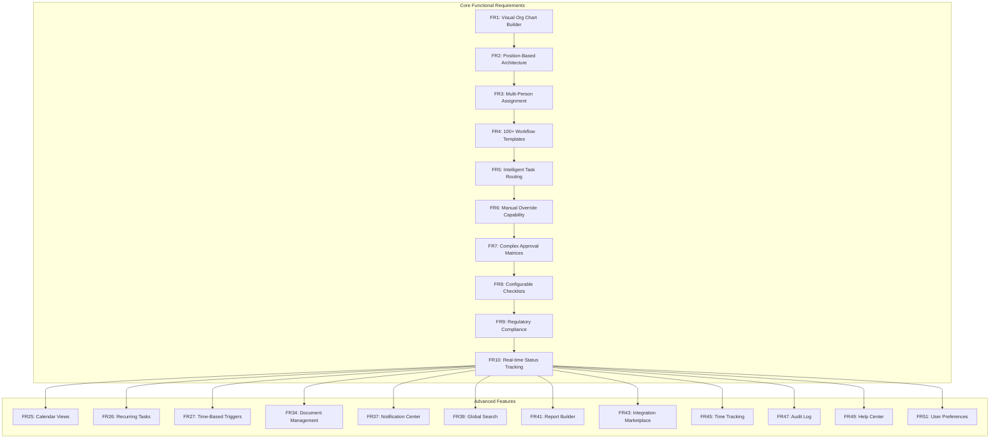
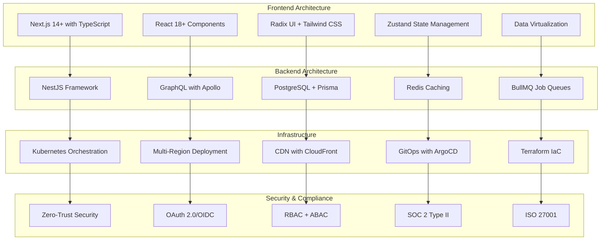
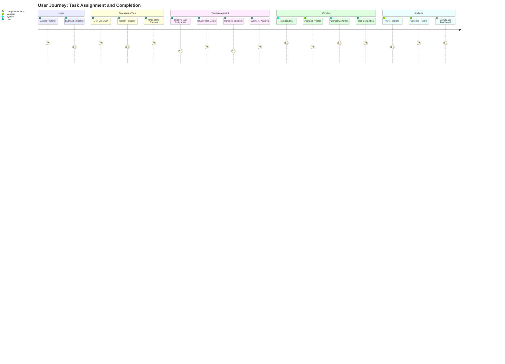
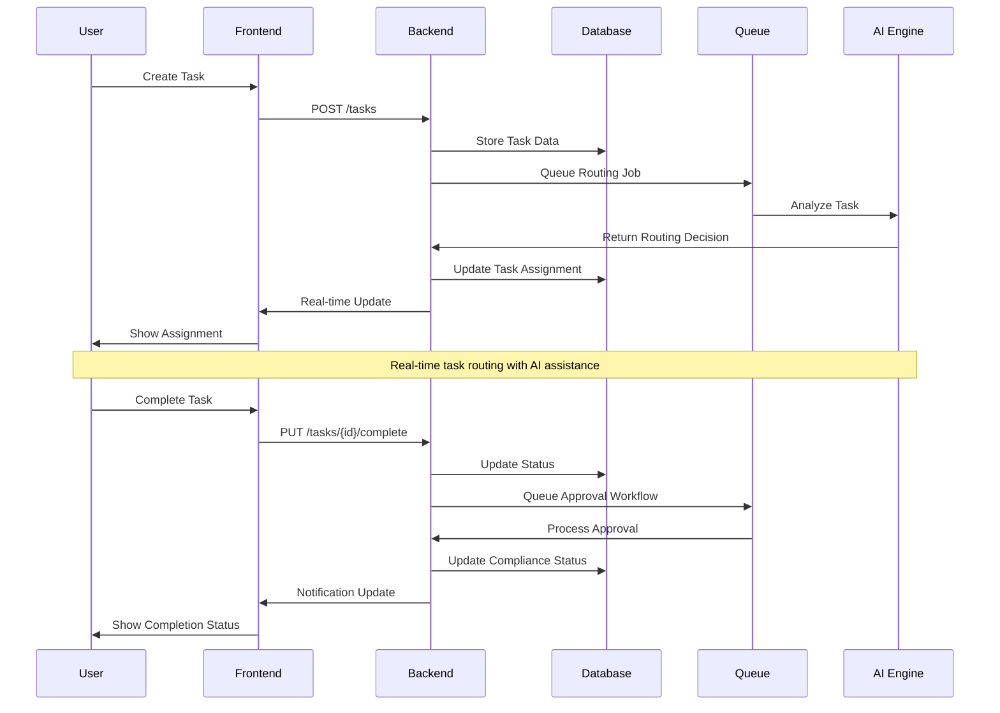
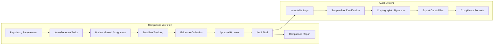
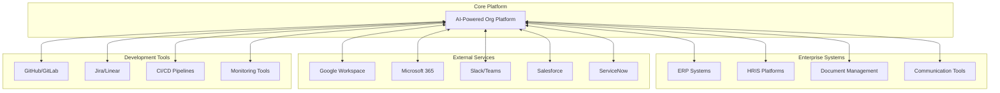

# AI-Powered Organizational Hierarchy Platform - PRD Mermaid Diagram

This document contains a comprehensive Mermaid diagram visualizing the structure and relationships within the PRD.

## System Architecture Overview

## Epic Relationships & Dependencies

## Functional Requirements Flow

## Technical Architecture Components

## User Journey Flow

## Data Flow Architecture

## Compliance & Audit Flow

## Integration Ecosystem

This comprehensive Mermaid diagram collection visualizes the entire PRD structure, showing:

1. **System Architecture Overview** - Core components and their relationships
2. **Epic Relationships & Dependencies** - Development phases and dependencies
3. **Functional Requirements Flow** - How requirements build upon each other
4. **Technical Architecture Components** - Technology stack and infrastructure
5. **User Journey Flow** - End-to-end user experience
6. **Data Flow Architecture** - System interactions and data flow
7. **Compliance & Audit Flow** - Regulatory compliance process
8. **Integration Ecosystem** - External system connections

Each diagram provides a different perspective on the platform, making it easier to understand the complex relationships and dependencies within this enterprise-grade organizational management system.

